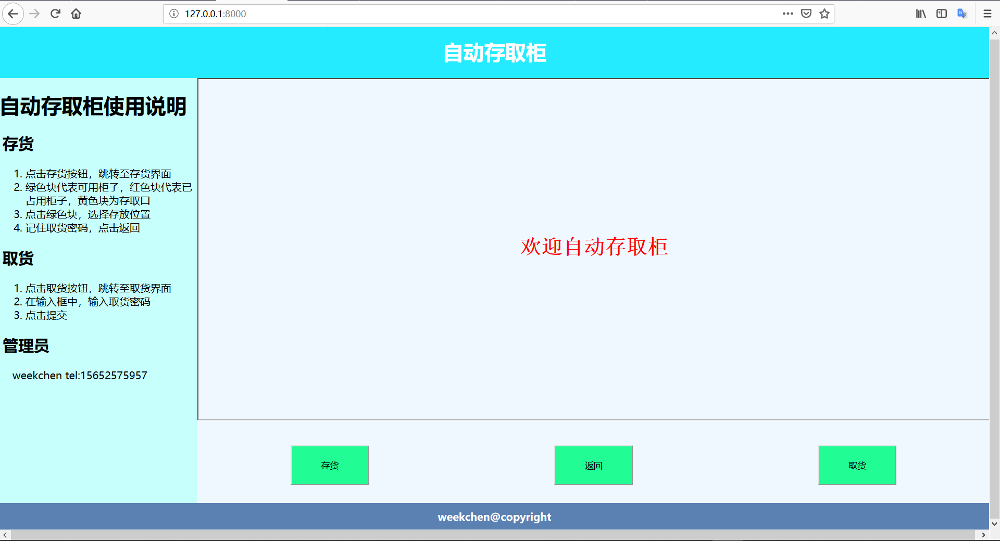
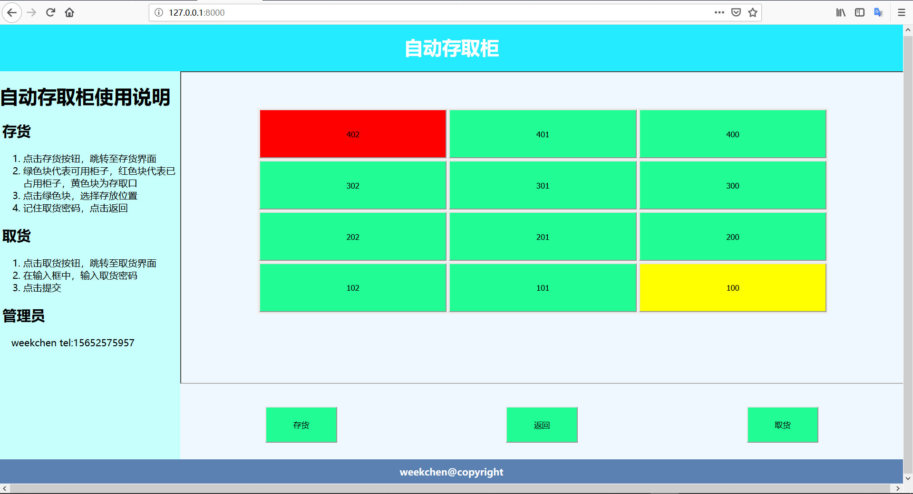
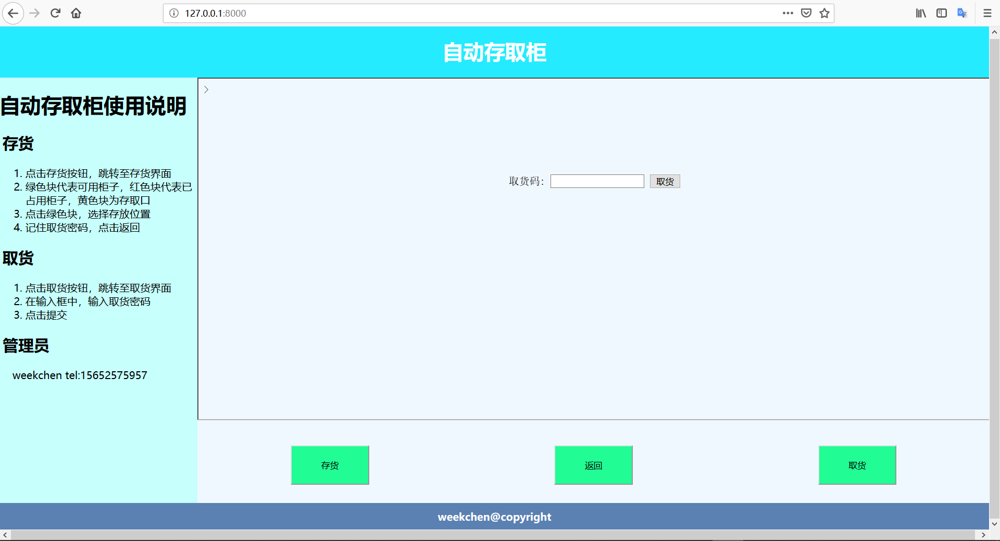

### **机电一体化设计与实践**
#### **项目名称**：自动存取柜

#### IDE：Pycharm

#### **运行环境**
###### windows
###### python3 
###### 开发语言：python javascript

#### **依赖的第三方库**
###### Django
###### PyMySql
###### mysqlclient

#### **工程详解**
- 当前工程是使用django框架的网页项目
- 运行程序命令为：`python manage.py runserver 0.0.0.0:8000`
- 运行后打开<a href="http://127.0.0.1:8000" target="_blank">网站url</a>  

#### **学习资料**
- <a href="https://www.liaoxuefeng.com/wiki/0014316089557264a6b348958f449949df42a6d3a2e542c000/" targrt="_blank">Python</a>
- <a href="http://www.runoob.com/html/html-tutorial.html" targrt="_blank">HTML</a>
- <a href="http://www.w3school.com.cn/js/index.asp" targrt="_blank">JavaScript</a>
- <a href="https://www.w3cschool.cn/django/" targrt="_blank">Django</a>
- <a href="http://www.cnblogs.com/linu/articles/8452773.html" targrt="_blank">python之django框架前端与后端的结合</a>
#### **网页界面**
###### 首页

###### 存货页面 

###### 取货页面


#### **运行报错解决**
- 
```
    raise ImproperlyConfigured('mysqlclient 1.3.13 or newer is required; you have %s.' % Database.__version__)
    django.core.exceptions.ImproperlyConfigured: mysqlclient 1.3.13 or newer is required; you have 0.9.3.
```
  **解决办法** ：C:\Python37\Lib\site-packages\django\db\backends\mysql（python安装目录）打开base.py，注释掉以下内容：　
```　　　　　   
    if version < (1, 3, 13):
       raise ImproperlyConfigured('mysqlclient 1.3.13 or newer is required; you have %s.' % Database.__version__) 
```     

- 
```
    File "C:\Python37\lib\site-packages\django\db\backends\mysql\operations.py", line 146, in last_executed_query
    query = query.decode(errors='replace')
　　 AttributeError: 'str' object has no attribute 'decode'
```
  **解决办法**：打开此文件把146行的decode修改为encode